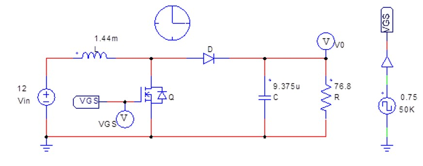

# Electrónica de Potencia: Validación de Convertidores DC/DC (Buck & Boost)

**Estado del Proyecto:** Simulación, Análisis Teórico y Validación de Hardware completados en las topologías Buck y Boost.

    
    

---

## 1. Resumen del Proyecto

Este repositorio consolida la experiencia en el diseño y validación de **Convertidores DC/DC** utilizando simulación y pruebas en hardware. El objetivo es demostrar el dominio en el control y análisis de topologías de potencia esenciales:

1.  **Regulador Reductor (Buck Converter):** Validación de hardware, enfocada en la conmutación real de MOSFETs de potencia y la medición de circuitos auxiliares (opto driver).
2.  **Regulador Elevador (Boost Converter):** Simulación teórica para el cálculo de rizado de corriente (ΔIL) y voltaje (ΔVo), y análisis del principio de operación.

Este enfoque dual (teoría/simulación + validación/hardware) es un punto de venta muy fuerte para roles de Ingeniería de Pruebas y Aplicaciones.

---

## 2. Documentación Técnica (3 Informes)

El proyecto está documentado en tres informes técnicos que cubren la teoría, la simulación PSIM y los resultados experimentales:

### A. Validación de Hardware del Regulador Buck (Práctica)

* **Parte 1: Principio de operación del regulador reductor (parte 1)**
    * [Ver Reporte Parte 1](./250324_341838_JARH_T07.pdf)
* **Parte 2: Principio de operación del regulador reductor (parte 2)**
    * [Ver Reporte Parte 2](./250330_341838_JARH_T08.pdf)

### B. Análisis Teórico y Simulación Buck/Boost (Teoría)

* **Regulador Reductor y Elevador (Simulación PSIM)**
    * **[Ver Reporte Tarea 3 (PSIM)](./250216_341838_JA_T03.pdf)**

---

## 3. Competencias Demostradas

* **Simulación de Potencia:** Uso de **PSIM** para modelar topologías Buck y Boost, y análisis de formas de onda (ripple) en corriente y voltaje.
* **Validación de Hardware:** Experiencia práctica en el montaje de circuitos de potencia, accionamiento de **MOSFETs de alto voltaje** (IRFP460A) y comprobación del circuito de control.
* **Instrumentación:** Dominio en la medición de señales de conmutación de alta velocidad utilizando el **Osciloscopio** y análisis de resultados contra la teoría.
* **Análisis Documental:** Capacidad para generar documentación técnica detallada que respalde el trabajo de ingeniería.

**(Imagen de Simulación PSIM Buck/Boost)**

**(Imagen de Validación en Laboratorio Buck Converter)**

